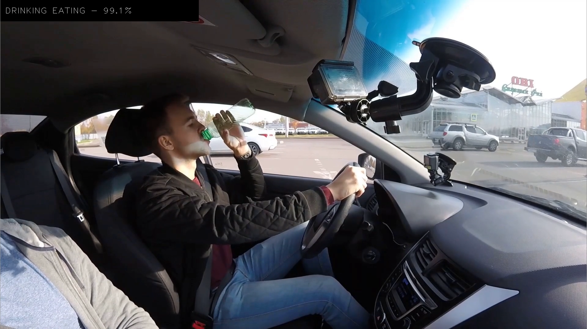

# Model name: driver-action-recognition-adas-0002-decoder

## Use Case and High-Level Description

This is an action recognition model for the driver monitoring use case. The model uses Video Transformer approach with MobileNetv2 encoder. It is able to recognize the following actions: drinking, doing hair or making up, operating the radio, reaching behind, safe driving, talking on the phone, texting.

This model is only decoder part of the whole pipeline. It accepts stack of frame embeddings, computed by driver-action-recognition-adas-0002-encoder, and produces prediction on input video. Video frames should be sampled to cover ~1 second fragment (i.e. skip every second frame in 30 fps video). 

## Example

## Specification

| Metric                          | Value                                     |
|---------------------------------|-------------------------------------------|
| Source framework                | PyTorch*                                  |
| GFlops                          | 0.147                                     |
| MParams                         | 4.205                                     |

## Performance
Link to [performance table](https://software.intel.com/en-us/openvino-toolkit/benchmarks)

## Inputs

1. name: "0" , shape: [1x16x512] - An embedding image in the format [BxTxC],
   where:
    - B - batch size.
    - T - Duration of input clip.
    - C - dimension of embedding. 

## Outputs

The model outputs a tensor with the shape [bx9], each row is a logits vector of performed actions.

## Legal Information
[*] Other names and brands may be claimed as the property of others.
